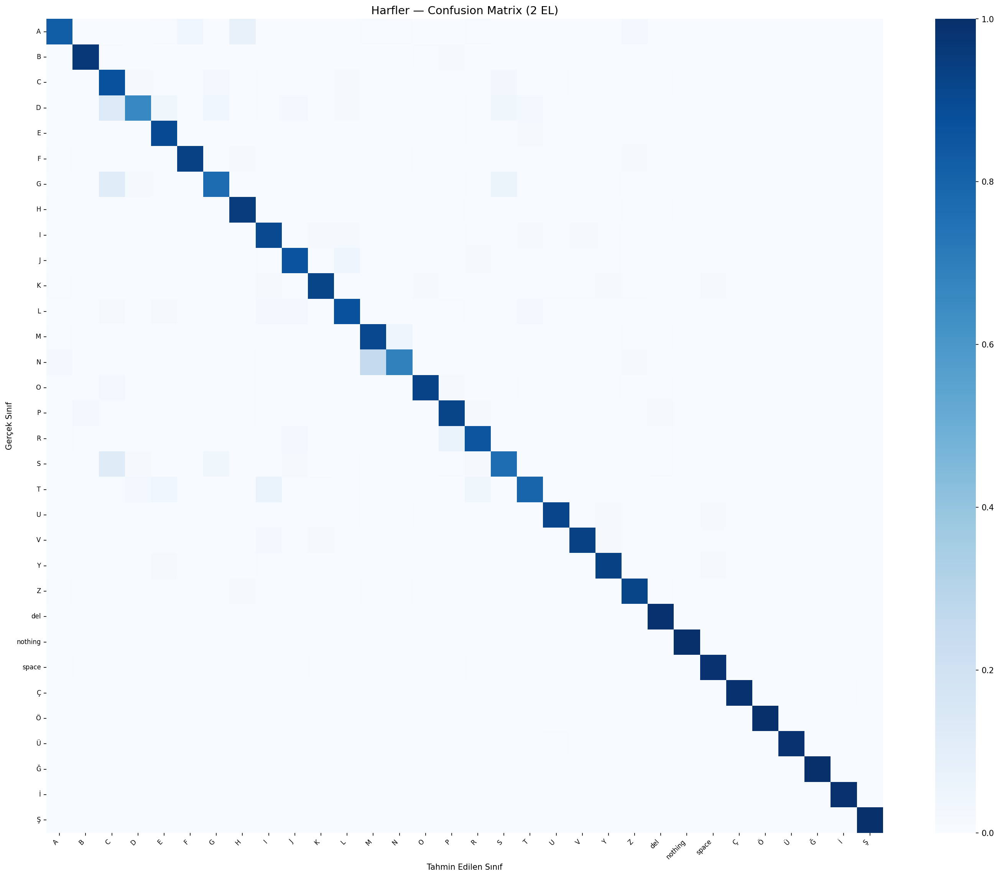

# Turkish Sign Language Recognition System (TİD)

> **Computer Engineering Graduation Project** — A mobile-based Turkish Sign Language recognition system developed using MediaPipe, TensorFlow/Keras, TensorFlow Lite, Python, and Android.

## About the Project

This project was developed to recognize **Turkish Sign Language (Türk İşaret Dili — TİD)** gestures through a camera and convert recognized signs into text.

The system combines a machine learning pipeline developed in Python with an Android mobile application. Hand landmarks are extracted using **MediaPipe**, processed by trained machine learning models, and classified into corresponding Turkish Sign Language signs.

The project consists of two main components:

* **Machine Learning Pipeline:** Dataset processing, hand landmark extraction, model training, evaluation, inference, and TensorFlow Lite conversion.
* **Android Application:** Real-time camera-based sign recognition using the trained TensorFlow Lite models.

---

## Features

* Real-time hand landmark detection
* Turkish Sign Language letter recognition
* Number recognition
* Word recognition
* MediaPipe Hand Landmarker integration
* TensorFlow Lite model inference on Android
* Camera-based recognition
* User registration and login
* Recognition history
* Mobile-optimized machine learning models

---

## System Architecture

The general workflow of the system is:

```text
Camera Input
     │
     ▼
MediaPipe Hand Landmarker
     │
     ▼
Hand Landmark Extraction
     │
     ▼
Feature Processing
     │
     ▼
TensorFlow Lite Model
     │
     ▼
Sign Classification
     │
     ▼
Recognized Text
```

For model development:

```text
Dataset
   │
   ▼
Data Loading
   │
   ▼
Hand Landmark Extraction
   │
   ▼
Feature Preparation
   │
   ▼
Model Training
   │
   ▼
Model Evaluation
   │
   ▼
TensorFlow Lite Export
   │
   ▼
Android Application
```

---

## Technologies

### Machine Learning

* Python
* TensorFlow
* Keras
* MediaPipe
* NumPy
* Scikit-learn
* TensorFlow Lite

### Mobile Application

* Kotlin
* Android Studio
* TensorFlow Lite
* MediaPipe
* Firebase

### Development Tools

* Visual Studio Code
* Android Studio
* Git
* GitHub

---

## Project Structure

```text
BitirmeProjesi/
│
├── mobil/
│   ├── app/
│   │   ├── src/
│   │   │   └── main/
│   │   │       ├── assets/
│   │   │       │   ├── hand_landmarker.task
│   │   │       │   ├── letter_classes.json
│   │   │       │   ├── letter_model_2hands.tflite
│   │   │       │   ├── number_classes.json
│   │   │       │   ├── number_model.tflite
│   │   │       │   ├── word_classes.json
│   │   │       │   └── word_model.tflite
│   │   │       │
│   │   │       ├── java/
│   │   │       │   └── com/example/tidapp/
│   │   │       │       ├── HandFeatureExtractor.kt
│   │   │       │       ├── LoginActivity.kt
│   │   │       │       ├── MainActivity.kt
│   │   │       │       ├── MenuActivity.kt
│   │   │       │       ├── RecordsActivity.kt
│   │   │       │       └── RegisterActivity.kt
│   │   │       │
│   │   │       └── res/
│   │   │
│   │   └── build.gradle.kts
│   │
│   └── settings.gradle.kts
│
├── turk_isaret_dili_proje/
│   └── tid_pipeline/
│       ├── config.py
│       ├── dataset_loader.py
│       ├── dataset_loader_parallel.py
│       ├── feature_extraction.py
│       ├── model.py
│       ├── trainer.py
│       ├── inference.py
│       ├── inference_example.py
│       ├── inference_mobil.py
│       ├── demo.py
│       ├── export_tflite.py
│       ├── main.py
│       ├── train_number.py
│       ├── train_turkish_letters_mirror.py
│       ├── hand_landmarker.task
│       ├── requirements.txt
│       │
│       ├── data/
│       │   └── [Training datasets - not included in repository]
│       │
│       └── output/
│           ├── evaluation_summary.json
│           ├── harfler_confusion_matrix.png
│           ├── letter_classes.json
│           ├── letter_model_2hands.h5
│           ├── letter_model_2hands.tflite
│           └── letter_model_2hands_history.csv
│
├── .gitignore
└── README.md
```

---

## Machine Learning Pipeline

The machine learning component is located under:

```text
turk_isaret_dili_proje/tid_pipeline/
```

The pipeline includes separate modules for:

* Dataset loading
* Parallel dataset processing
* Hand landmark extraction
* Feature preparation
* Model creation
* Model training
* Evaluation
* Inference
* TensorFlow Lite conversion
* Mobile inference testing

MediaPipe Hand Landmarker is used to obtain hand landmarks from input images or camera frames.

The extracted hand features are then processed by the trained classification models.

---

## Models

The Android application contains separate TensorFlow Lite models for different recognition tasks.

| Model                        | Purpose                                  |
| ---------------------------- | ---------------------------------------- |
| `letter_model_2hands.tflite` | Turkish Sign Language letter recognition |
| `number_model.tflite`        | Number recognition                       |
| `word_model.tflite`          | Word recognition                         |
| `hand_landmarker.task`       | MediaPipe hand landmark detection        |

The models are stored under:

```text
mobil/app/src/main/assets/
```

TensorFlow Lite is used so that inference can be performed directly on the Android device.

---

## Model Evaluation

The repository contains model evaluation outputs generated during development.

The evaluation files can be found under:

```text
turk_isaret_dili_proje/tid_pipeline/output/
```

These include:

* Evaluation summary
* Training history
* Class information
* Trained model files
* Confusion matrix

### Letter Recognition Confusion Matrix



---

## Dataset

The datasets used to train the models are **not included in this repository due to their size**.

The local dataset directory is:

```text
turk_isaret_dili_proje/tid_pipeline/data/
```

This directory is intentionally excluded from version control through `.gitignore`.

After obtaining the required datasets, place them inside the `data/` directory before running the training pipeline.

---

## Installation

### 1. Clone the Repository

```bash
git clone https://github.com/YunusEmreInel/BitirmeProjesi.git
cd BitirmeProjesi
```

### 2. Create a Python Virtual Environment

```bash
python -m venv .venv
```

### 3. Activate the Virtual Environment

#### Windows

```bash
.venv\Scripts\activate
```

#### Linux / macOS

```bash
source .venv/bin/activate
```

### 4. Install Dependencies

```bash
pip install -r turk_isaret_dili_proje/tid_pipeline/requirements.txt
```

---

## Running the Python Pipeline

Navigate to the machine learning pipeline directory:

```bash
cd turk_isaret_dili_proje/tid_pipeline
```

The main pipeline entry point is:

```bash
python main.py
```

Additional scripts are available for individual operations such as model training, inference, testing, and TensorFlow Lite export.

---

## Android Application

The Android project is located under:

```text
mobil/
```

To run the application:

1. Open the `mobil` directory with **Android Studio**.
2. Allow Gradle to synchronize the project.
3. Configure Firebase if required.
4. Connect an Android device or start an emulator.
5. Build and run the application.

The machine learning models required by the Android application are already located under:

```text
mobil/app/src/main/assets/
```

---

## Firebase Configuration

The Firebase configuration file:

```text
mobil/app/google-services.json
```

is intentionally excluded from the repository.

If Firebase services are required, create or use your own Firebase project and place the corresponding `google-services.json` file in:

```text
mobil/app/
```

Sensitive configuration files should not be committed to a public repository.

---

## Files Excluded from Git

The following files and directories are intentionally excluded from version control:

* Training datasets
* Python virtual environments
* Android build outputs
* Firebase configuration
* Environment files
* Signing keys and keystores
* IDE-specific configuration
* Temporary and cache files

This keeps the repository lightweight and prevents local or sensitive files from being published.

---

## Project Objective

The main objective of this project is to explore how **computer vision, hand landmark extraction, machine learning, and mobile technologies** can be combined to build an accessible Turkish Sign Language recognition system.

The project demonstrates an end-to-end workflow from:

**dataset preparation → feature extraction → model training → evaluation → TensorFlow Lite conversion → Android deployment**

---

## Project Status

This project was developed as a **Computer Engineering graduation project** focused on real-time Turkish Sign Language recognition on mobile devices.

---

## Author

**Yunus Emre İnel**

GitHub: [YunusEmreInel](https://github.com/YunusEmreInel)
